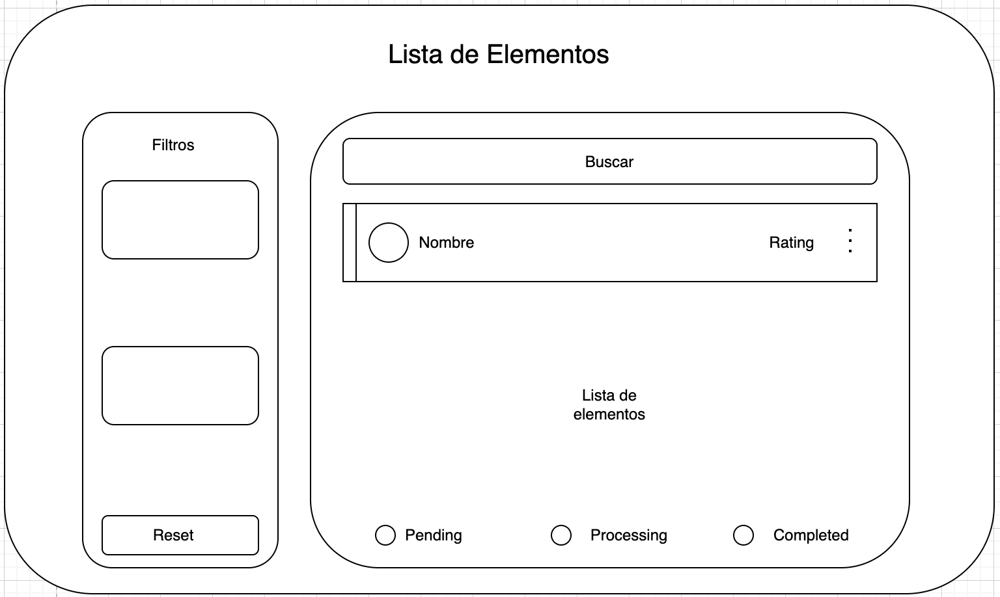

# Watchlist

A watchlist for items of various types.  
Created by Alex Pace.

## 📌 Index

- [Description](#description)
- [Initial Idea](#initial-idea)
- [Installation](#installation)
- [Usage](#usage)

## 📝 Description

This project is a desktop application built with [Electron](https://www.electronjs.org/).  
Its goal is to serve as a **watchlist** for various types of items, such as **"movie"**, **"book"**, or **"game"**.  
Each item can have a status, with options like **"pending"**, **"processing"**, or **"completed"**.  
It allows users to **add, edit, delete, filter, and sort** the list of items.  
Additionally, it features a **detailed error-checking system** across the application.

## 💡 Initial Idea

The initial design idea created with draw.io is as follows:



## ⚙️ Installation

Steps to install and run the project on your computer:

### 🔗 Prerequisites

Make sure you have **Node.js** and **NPM** installed:

- [Node.js](https://nodejs.org/)
- [npm](https://www.npmjs.com/)

### 🚀 Steps

1. Clone the repository:

    ```bash
    git clone https://github.com/user/repository-name.git
    ```

2. Navigate to the project directory:

    ```bash
    cd repository-name
    ```

3. Install dependencies:

    ```bash
    npm install
    ```

4. Start the application:

    ```bash
    npm start
    ```

## 🎯 Usage

- To **add an item**, press `"New"`.
- For more options on an item, click the **three dots** on the right side of the task.  
  A dropdown menu will appear with options to:
  - **Edit the status**
  - **Edit the item**
  - **Delete it**
- To view an item's notes, **hover over its name**.
- To **filter**, check the boxes with the values you want to display.
- To **sort**, select an option from the dropdown.  
  If you want to reverse the list, enable **"Descending?"**.
- To **filter by range**, enter both values, and the list will automatically update.
- To **search**, type the desired text into the search bar.  
  The search will automatically filter by:
  - **Item name** (`startsWith`)
  - **Notes content** (`includes`)
